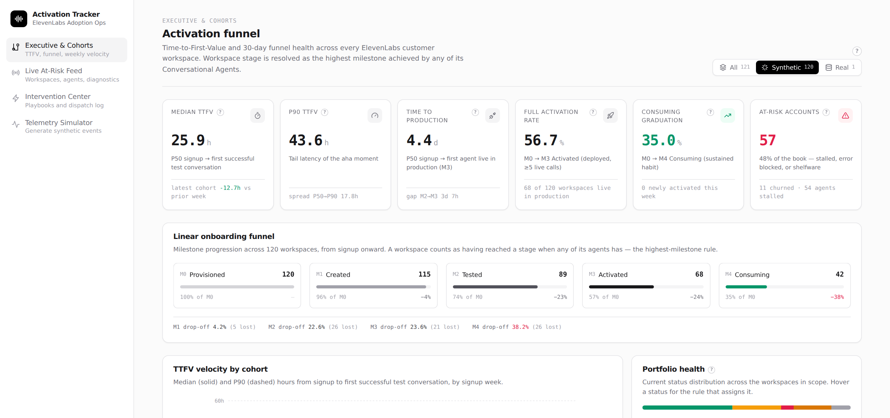
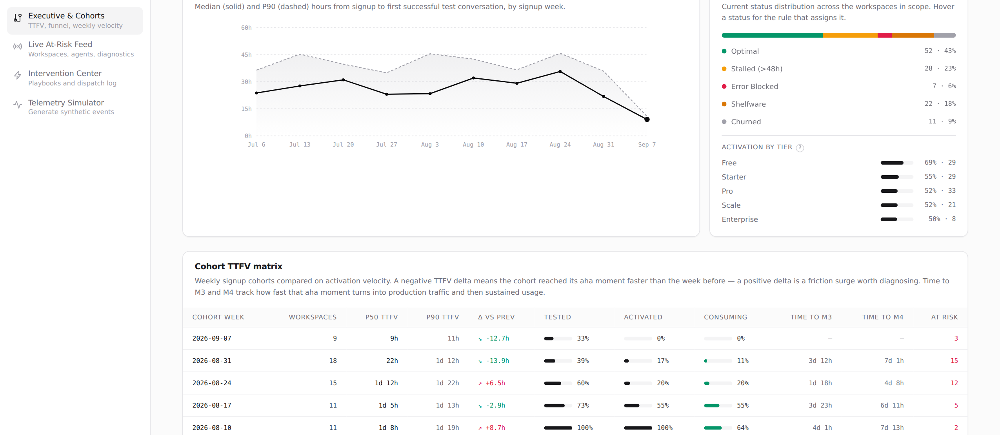
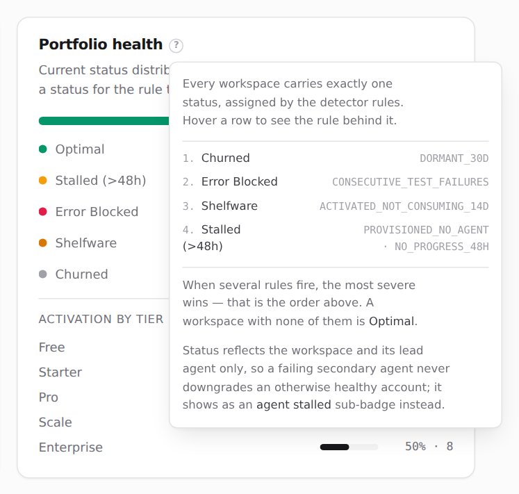
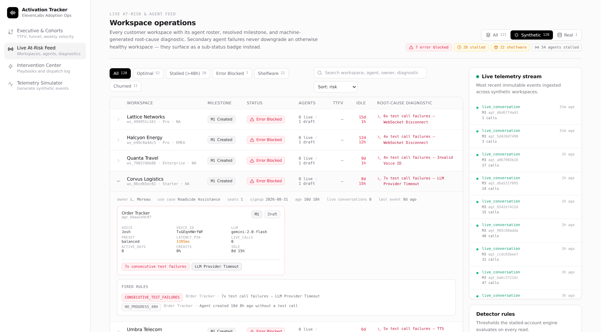
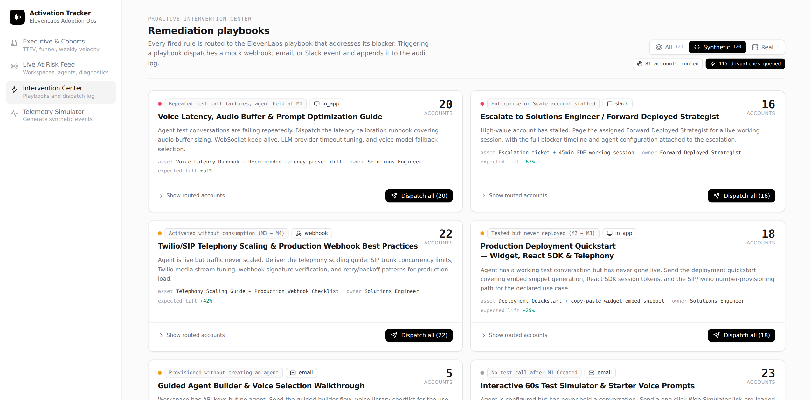
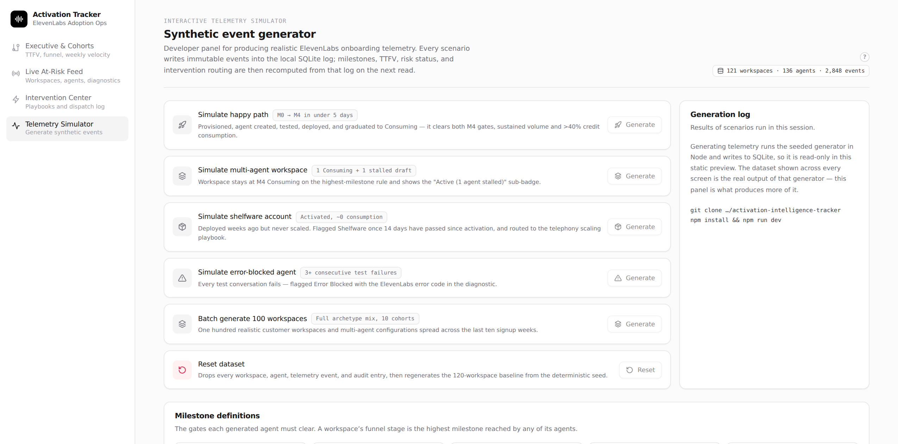

# ElevenLabs Activation Tracker

Internal **Adoption & Operations Control Center** for ElevenLabs Conversational Voice AI.

Most churn on a developer platform is silent. Teams evaluating ElevenLabs get stuck configuring an
agent, calibrating voice latency, running a simulator test, or wiring up a webhook / SIP trunk —
and instead of filing a ticket, they abandon the workspace. This app tracks the 30-day onboarding
funnel of every customer workspace in real time, computes Time-to-First-Value (TTFV), diagnoses
ElevenLabs-specific runtime blockers automatically, and routes each one to a remediation playbook.

**[Open the live dashboard →](https://claude.ai/code/artifact/b7e3ce8a-c87b-4e81-9bed-97027c3fd500)**

A static snapshot of the running app: the real engine output, exported to JSON and rendered as a
standalone page. Every number in it was computed by the code in this repository. Use the
**source selector** in the header to switch between the synthetic portfolio and a connected real
ElevenLabs account — the screenshots below are all from the synthetic scope. Navigation, filters,
search, sorting and tooltips all work there; the buttons that would write telemetry or dispatch a
playbook are inert, since a static page has no database. Run it locally for those.

---

## Screens

Everything below is read against one five-step chain, which every customer workspace moves along:

**M0** Provisioned → **M1** agent Created → **M2** Tested *(the aha moment)* →
**M3** Activated *(live in production)* → **M4** Consuming *(a sustained habit)*

That is the whole vocabulary — [the exact gate for each step](#the-five-milestones) is further down.
**TTFV** (Time-to-First-Value) is how long a workspace takes to get from M0 to M2.

Every view is scoped by the **source selector** in its header — `All`, `Synthetic`, or `Real` —
so aggregate metrics are never silently computed over a blend of generated and real accounts. The
scope travels with navigation and filters the telemetry stream too.

### `/dashboard/funnel` — Executive & Cohorts



Six KPIs: median and P90 TTFV, time to production (M0→M3 in days), full activation rate (M0→M3),
consuming graduation rate (M0→M4), and the at-risk counter. Each carries a tooltip stating the
exact gate it measures, so no number on this page is a black box.

The funnel strip below them is the whole portfolio in one line. Reading the screenshot: 120
workspaces provisioned, 115 created an agent, 89 got a successful test call, 68 reached production,
42 sustained usage. The biggest single leak is **M4 at −38%** — accounts that went live and never
built a habit — which is a different problem, and a different playbook, from the 23% who never
deployed at all.

Per-stage **drop-off is split into `stalled` and `still moving`**, because the raw number conflates
two different things: a workspace resting at the previous stage with a fired rule is genuinely
stuck, while one with no fired rule simply has not arrived yet. Counting both as loss overstates
the leak — most of all at M4, where the consumption gate spans a 30-day window.



**Cohorts are weekly signup buckets**, which is what makes the TTFV numbers comparable: a cohort
that signed up three weeks ago has had three weeks to activate, so comparing it against one that
signed up yesterday would measure elapsed time, not friction. The `Δ vs prev` column is the whole
point — a negative delta means this week's customers hit their aha moment faster than last week's;
a positive one is a friction surge worth diagnosing while it is still happening.

**Activation by tier** answers whether willingness to pay predicts activation. In the screenshot it
does not: Free activates at 69% and Enterprise at 50%. That inversion is the signal — bigger
accounts have more stakeholders, more security review, and more custom integration work between
signup and first production call.



**Portfolio health** shows the status distribution, with the rule behind each status on hover and a
`?` explaining the whole model. Statuses are ordered by severity and the most severe wins, so every
workspace carries exactly one. Status is computed from the workspace and its **lead agent only** —
a failing secondary agent shows as an `agent stalled` sub-badge rather than downgrading an account
that is otherwise working. The rule IDs in that panel are read straight off the engine's rule
catalogue, so the explanation cannot drift from what actually runs.

### `/dashboard/live-feed` — Live At-Risk & Agent Feed



The operational counterpart to the executive view: not *how many* accounts are stuck, but *which
ones and why*. Filterable by status and searchable across workspaces, agents, owners and
diagnostics; sorted by severity by default, so whatever is most broken is the first thing on screen.

The column that earns the page is **root-cause diagnostic** — a generated string, not a status
label. The four Error Blocked accounts visible here share a status but not a problem:
`WebSocket Disconnect` twice, `Invalid Voice ID`, `LLM Provider Timeout`. Same badge, three
different fixes. A dashboard that stopped at "Error Blocked" would send one generic email to all
four.

Expanding a row shows the workspace metadata, then a card per agent with its real configuration —
voice, voice ID, LLM, latency preset, observed P50 latency, live call volume, credits, idle time —
and a **FIRED RULES** block naming every rule that matched and the evidence it matched on. That
block is the audit trail: it is why the account is flagged, in the engine's own words.

Notice that all four are at **M1 Created with no TTFV**. They are not stalled customers who lost
interest; they never got a single test call to work.

### `/dashboard/interventions` — Proactive Intervention Center



Each fired rule routes to the playbook that addresses its blocker:

| Blocker | Playbook |
| --- | --- |
| No test call after M1 Created | Interactive 60s Test Simulator & Starter Voice Prompts |
| Repeated test call failures, agent held at M1 | Voice Latency, Audio Buffer & Prompt Optimization Guide |
| Tested but never deployed (M2 → M3) | Production Deployment Quickstart — Widget, React SDK & Telephony |
| Activated without consumption (M3 → M4) | Twilio/SIP Telephony Scaling & Production Webhook Best Practices |
| Enterprise / Scale account stalled | Escalate to Solutions Engineer / Forward Deployed Strategist |
| Provisioned without an agent | Guided Agent Builder & Voice Selection Walkthrough |
| No telemetry for 30+ days | Dormant Workspace Reactivation Campaign |

Each card carries the trigger that routed the account there, the asset it sends, the channel, the
owning role, and the count of accounts queued behind it. Routing is not one-rule-one-playbook:
`NO_PROGRESS_48H` fires at both M1 and M2, and the blocker is different at each, so the router
reads the workspace's milestone and sends an untested agent to the simulator nudge but a
tested-but-undeployed one to the deployment quickstart.

One-click **Trigger** (or **Dispatch all**) fires a mock webhook / email / Slack event and appends
it to the audit log. Accounts contacted in the last 7 days are suppressed automatically, so a
strategist working the queue never sends the same account the same thing twice.

### `/simulator` — Interactive Telemetry Simulator



Buttons to generate live synthetic events: happy path (M0 → M4 in under 5 days, clearing both M4
gates), multi-agent workspace (1 consuming + 1 stalled draft), shelfware account, error-blocked
agent, and a batch of 100 realistic workspaces across ten cohorts. A reset button drops the dataset
and regenerates the baseline.

Every scenario writes **real telemetry events** — the dashboards recompute from that log, nothing
is faked at the presentation layer. That is what each button's stated outcome is really asserting:
press *Simulate error-blocked agent* and the engine has to derive Error Blocked at M1 on its own,
from the failed test conversations the scenario appended. If the rules were wrong, the button
would visibly produce the wrong badge.

---

## Quick start

```bash
npm install
npm run dev
```

Open <http://localhost:3000>. That is the whole setup — no database server, no API keys, no
external services. On first read the app creates `data/tracker.db` (SQLite) and seeds it with 120
synthetic workspaces spread across ten weekly signup cohorts, so every screen is populated
immediately.

| Command | What it does |
| --- | --- |
| `npm run dev` | Start the dev server (auto-creates and seeds the database) |
| `npm run build` / `npm start` | Production build and serve |
| `npm run typecheck` | `tsc --noEmit` |
| `npm run lint` | ESLint (`next lint`) |
| `npm run seed [count]` | Add a batch to the database from the CLI (default: the 120-workspace baseline) |
| `npm run export:snapshot [file]` | Dump a full engine snapshot (metrics, funnel, cohorts, workspace health, intervention queue) to JSON |
| `npm run db:reset` | Delete the local database; it reseeds on the next read |
| `npm test` | Run the engine and ingest-mapping tests (`lib/*/__tests__`) |
| `npm run ingest:elevenlabs` | Ingest a connected ElevenLabs account (needs `ELEVENLABS_API_KEY`) |

---

## The five milestones

Every agent moves through a linear, monotonic milestone chain. Gates are enforced by the engine,
not by the seeder — a generated agent only reaches a milestone if its telemetry actually clears
the gate.

| | Milestone | Gate |
| --- | --- | --- |
| **M0** | Provisioned | Workspace created, tier selected (`Free` → `Enterprise`), API keys generated |
| **M1** | Created | First Conversational Agent created — Voice ID assigned, system prompt configured, LLM provider and latency preset selected |
| **M2** | Tested *(aha moment)* | First successful test conversation in the Web Simulator or SDK test bench: **≥10s**, zero synthesis or WebSocket errors |
| **M3** | Activated *(technical value)* | Deployed via Web Widget, React SDK, or SIP/Twilio telephony **and** ≥5 live conversations |
| **M4** | Consuming *(business value)* | Sustained usage in any trailing 30-day window: **≥50** live conversations with **≥3** distinct active days inside a single week, **or** **>40%** of tier voice credits consumed |

### Workspace vs. agent resolution

A workspace has **1:N agents**, and the two levels are resolved by different rules:

- **Workspace funnel stage = `MAX(agent_milestone)`.** A customer with one agent at M4 Consuming
  and a second at M1 Created stays **M4** in every macro metric.
- **Secondary-agent failures never downgrade the workspace.** If a non-lead agent fails repeatedly,
  the workspace keeps its status and shows a sub-badge: `Active (1 agent stalled)`.
- **TTFV** = hours from workspace creation (M0) to the **first agent** reaching M2 Tested. Time to
  activation (M3) and time to consuming (M4) are tracked alongside it.

### Where the 30 days actually applies

The dashboard never hides or expires an account — every workspace stays visible for as long as it
exists, whatever its age. "30-day onboarding funnel" describes the period the metrics are designed
around, not a retention window on the UI. Thirty days appears in exactly two places, both
measurement windows:

- **The M4 volume gate** counts conversations inside a **trailing** 30-day window, evaluated at
  every conversation. It is not pinned to the signup date, so an account that ramps in month three
  is measured on the same terms as one that ramps in week two. The credit path to M4 has no window
  at all.
- **`DORMANT_30D`** marks an account churned after 30 days of total silence below M4. That window
  is relative to the last event, not to signup.

Everything else — TTFV, the M1/M2/M3 gates, the 48h stall rule, the 14-day shelfware rule — has no
30-day boundary.

Milestones stay monotonic, so an account that reaches M4 and later goes quiet keeps M4 and is
caught by the shelfware and dormancy rules instead. Current-state regression is the risk status's
job, not the milestone's.

---

## Connecting a real ElevenLabs account

Synthetic data proves the engine works; it says nothing about real customers.
To ingest an actual account:

```bash
ELEVENLABS_API_KEY=sk_... npm run ingest:elevenlabs -- --dry-run
ELEVENLABS_API_KEY=sk_... npm run ingest:elevenlabs
```

Then switch the source selector to **Real**. Ingested workspaces are tagged
`source: 'elevenlabs'` and never blend into synthetic aggregates by accident —
selecting **All** with both present states the composition in the header.

### What counts as production

The API reports the **channel** a conversation arrived on, never whether a real
customer was on the other end. So the M3 gate turns on a judgement call, made
explicitly in `lib/ingest/elevenlabs.ts`:

| Counts as production (M3) | Counts as development (M2) |
| --- | --- |
| `widget`, `sip_trunk`, `twilio`, `twilio_sms`, `exotel`, `genesys`, `genesys_bot_connector`, `avaya`, `audiocodes`, `whatsapp`, and the business integrations (Zendesk, Salesforce, Intercom, Slack, Freshdesk, Telegram) | every SDK — `react_sdk`, `js_sdk`, `python_sdk`, `node_js_sdk`, `swift_sdk`, `flutter_sdk`, `android_sdk`, `react_native_sdk` — plus `template_preview`, `subagent_tool` and `unknown` |

Telephony and an embedded widget are only reachable by real end users. SDK
traffic is most often the customer's own engineer building the integration, and
counting it would hand out M3 to accounts that have never served anyone.

**This deliberately under-counts.** A customer whose product *is* an app with
the SDK embedded does serve real users through it, and will read as M2. That is
the safer error: it keeps the account visible as an activation target instead of
silently marking it won.

### Three things the API cannot tell us

- **No workspace creation date.** M0 falls back to the earliest agent creation,
  so TTFV is measured from first agent rather than signup and the M0 → M1 leg
  reads as zero. Pass `--signup <ISO date>` to measure it properly.
- **No credit consumption.** The M4 credit gate never fires; only the
  sustained-volume gate applies.
- **No subscription tier, region or seat count.** These stay `null` and render
  as `—`, with the count of such accounts shown under *Activation by tier*.
  Inventing a plan for a real customer would be worse than admitting the gap.

All three are reported by the adapter at ingest time rather than hidden — the
mapper returns them as `notes` alongside the mapped records.

### Technical failure vs. missed goal

`status: 'failed'` is a transport failure — the call broke. `call_successful:
'failure'` is the goal evaluation: an agent can complete a call flawlessly and
still be scored a failure for not achieving its objective. Only the former
feeds the error-blocked rule, so a merely unhelpful agent is never escalated as
a broken one.

### Privacy

The adapter requests `summary_mode=exclude` and reads only timing, duration,
channel and failure status. Transcripts and summaries are never fetched, and no
real account data is committed to this repository — the test fixtures in
`lib/ingest/__tests__` are synthetic.

---

## Architecture

```
app/
  actions.ts                  Server actions: dispatch playbooks, run scenarios, reset dataset
  dashboard/funnel            Executive & cohorts view
  dashboard/live-feed         Workspace / agent operations table
  dashboard/interventions     Playbook queue and dispatch audit log
  simulator                   Synthetic telemetry generator panel
lib/
  types.ts                    Domain model: milestones, workspaces, agents, events, rules, playbooks
  utils.ts                    Formatting and date helpers shared by engine and UI
  store.ts                    Request-cached, scope-filtered derived state for the pages
  db/
    schema.sql                SQLite DDL (append-only telemetry_events + supporting tables)
    client.ts                 Connection, schema bootstrap, additive migrations, truncate
    repository.ts             Typed data access
  engine/
    milestones.ts             Event-stream replay → agent milestone + milestone timestamps
    health.ts                 Stalled-account rule engine → risk status, signals, diagnostics
    metrics.ts                Funnel, weekly cohorts, executive KPIs
    interventions.ts          Signal → playbook routing and dispatch suppression
    rules.ts                  Rule thresholds and the playbook catalogue
    __tests__/                Milestone-gate tests
  ingest/
    elevenlabs.ts             Real-account adapter: API snapshot → workspace, agents, events
    elevenlabs-types.ts       The API fields this tracker consumes (no transcript fields exist here)
    __tests__/                Mapper tests, run through the real engine
  sim/
    generator.ts              Archetype-driven synthetic telemetry generator
    fixtures.ts               Voices, LLMs, tiers, ElevenLabs error taxonomy
    random.ts                 Seeded mulberry32 PRNG
    runner.ts                 Scenario execution
components/
  ui/                         Card, Badge, Button, Table, Tooltip, Progress primitives
  dashboard/                  KPI cards, funnel strip, cohort matrix, tables, simulator panel,
                              source selector, per-status rule notes
  layout/                     Sidebar and page header
scripts/
  seed.ts                     CLI seeding
  export-snapshot.ts          Derived engine output → JSON, optionally merging a real account
  ingest-elevenlabs.ts        Paginated account fetch → database
```

**Telemetry is the source of truth.** `telemetry_events` is append-only and immutable; milestones,
TTFV, risk status, and intervention routing are all *derived* by replaying that log on read
(`lib/engine/milestones.ts` walks each agent's events chronologically and records the timestamp at
which each gate first closed). Nothing writes a milestone directly, which is why the simulator and
a real ingestion pipeline would behave identically.

### Detector rules

| Rule | Fires when | Status |
| --- | --- | --- |
| `CONSECUTIVE_TEST_FAILURES` | ≥3 consecutive failed test conversations with no success since | Error Blocked |
| `DORMANT_30D` | No telemetry for 30+ days while below M4 | Churned |
| `ACTIVATED_NOT_CONSUMING_14D` | At M3 for >14 days without reaching M4 | Shelfware |
| `PROVISIONED_NO_AGENT` | Provisioned >48h ago with no agent created | Stalled |
| `NO_PROGRESS_48H` | >48h since the last milestone advance while below M3 | Stalled |

`NO_PROGRESS_48H` deliberately stops at M3: the M4 gate is a 30-day usage window, so above M3 the
governing rule is `ACTIVATED_NOT_CONSUMING_14D`. Thresholds live in `RULE_THRESHOLDS`
(`lib/engine/rules.ts`) and are surfaced in the UI next to the signals they produce.

---

## Stack

Next.js 14 (App Router) · TypeScript (strict) · React 18 · Tailwind CSS · Recharts · Lucide ·
better-sqlite3.

The UI follows the ElevenLabs design language: `#FBFBFB` canvas, white `rounded-xl` cards with
`border-zinc-200/80` and `shadow-xs`, deep-black action buttons, muted `emerald` / `rose` / `amber`
semantic accents, Inter with tight tracking for text, and JetBrains Mono for every timestamp,
latency figure, and error code. Fonts are linked rather than bundled so the app builds and runs
fully offline, falling back to the system sans/mono stacks.

### Notes

- `data/tracker.db` is gitignored. Delete it (or run `npm run db:reset`) to start from a clean
  baseline.
- Synthetic generation is deterministic: `lib/sim/random.ts` is a seeded mulberry32 PRNG, so the
  baseline dataset is reproducible while ad-hoc scenarios seed from the clock.
- `npm run export:snapshot` writes the derived engine output to a single JSON file without booting
  the server — useful for inspecting what the rules produce, or for building a static preview. Pass
  `--account <file>` to merge a connected account's snapshot, which is read from disk and never
  committed here.
- Tests run the real engine rather than mocking it: `lib/engine/__tests__` covers the milestone
  gates directly, and `lib/ingest/__tests__` maps a synthetic API payload and then asserts on what
  `evaluateWorkspace` derives from it.
